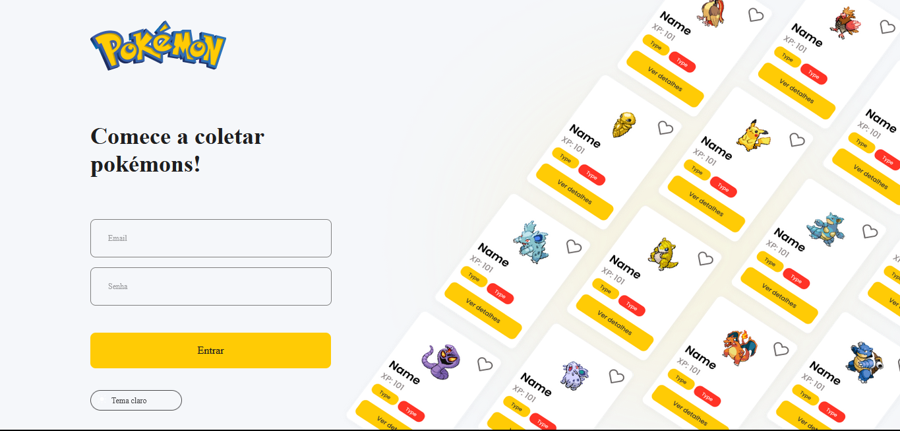
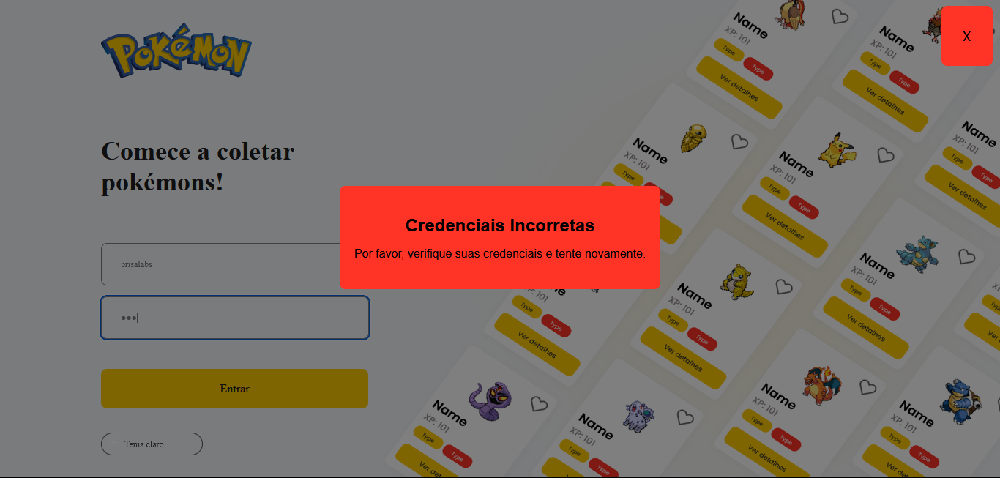
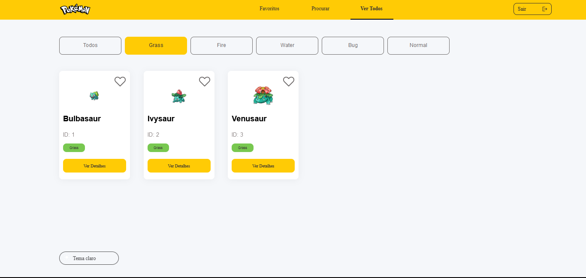

# Desafio Frontend Brisalabs - Pokédex App

Este é um desafio de frontend para a vaga de desenvolvedor frontend na Brisanet. O objetivo é criar uma aplicação web estilo Pokédex que consome a PokéAPI e oferece funcionalidades de login, listagem de Pokémon, filtragem, busca, favoritos e tema escuro.

## Como Executar o Projeto

1. Clone este repositório.
2. Instale as dependências com `npm install` ou `yarn install`.
3. Execute a aplicação com `npm start` ou `yarn start`.
4. Login e Senha (Email e Senha) são - Email: brisalabs Senha: teste

## Tecnologias Utilizadas

- ReactJS
- TypeScript
- Styled Components
- Context API
- Requisições à PokéAPI

## Funcionalidades

- **Página de Login**: Implementada com a funcionalidade de login e armazenamento do token no LocalStorage.
  

- **Verificação de Sessão**: A aplicação verifica se já existe uma sessão salva (token no LocalStorage). Se existir, redireciona para a página "Ver Todos"; caso contrário, redireciona para a página de login.
  

- **Listagem Completa e Filtragem(Página "Ver Todos")**: A página lista registros da API, limitando a exibição a 20 itens.
  

- **Busca e Listagem (Página "Procurar")**: É possível realizar a busca por um Pokémon específico e listar todos os registros encontrados.
  

- **Detalhes do Pokémon**: Um modal exibe as informações detalhadas de um Pokémon.
  

- **Favoritar Pokémon**: Implementado na página "Favoritos" com contagem de Pokémon favoritados no menu.
  
  

## Estrutura

Aqui está um exemplo de como o código está organizado:

- **`src`**: Pasta raiz do projeto.

  - **`components`**: Componentes reutilizáveis.

    - \*\*`home/ContentContainer.tsx` e `HomeStyles.ts` (Exemplo de componente e seu estilo).

  - **`pages`**: Páginas da aplicação.
    Todas as páginas tem sua pasta, com o arquivo index.tsx

  - **`services`**: Funcionalidades e serviços.

    - \*\*`AuthContext.tsx` (Contexto de autenticação).
    - \*\*`ProtectedRoute.tsx` (Componente de rota protegida).

  - **`styles`**: Estilos globais e temas.

  - **`assets`**: Recursos estáticos.
    - \*\*`images` (Imagens utilizadas na aplicação).
    - \*\*`fonts` (Fontes usados nos componentes).
  - **`redux`**: Gerenciamento de estados.

    - \*\*`reducers.ts`
    - \*\*`store.ts`

      - **`helpers`**: Funções auxiliares

    - \*\*`SearchData.ts` (Requisitando dados da API).

  - \*\*`App.tsx` (Arquivo principal do aplicativo).
  - \*\*`index.tsx` (Ponto de entrada do aplicativo).
